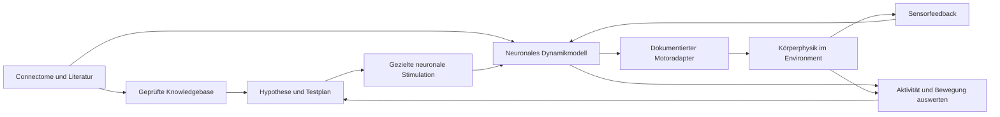

# C3-Plan: Fliegengehirn im virtuellen Körper

Stand: Sonntag, 4. Oktober 2026, nach lokalem Grundsetup, Europe/Berlin.
Vier Personen. Deadline **heute 15:00**, internes Abgabeziel **14:30**, Feature-Freeze **11:30**.
Track bleibt **03, Databricks „Agentic Scientific Discovery“**.

## 1. Die neue Vision

Ihr möchtet ein öffentliches Fliegen-Connectome beschaffen, Fachwissen über neuronale Funktionen in einer Knowledgebase sammeln, ein Gehirnmodell mit einem virtuellen Körper und Environment koppeln, bestimmte Neuronen stimulieren und Ganzhirnaktivität sowie Bewegung beobachten. Gewünschtes Verhalten ist auch Flug.

Omnigent organisiert Daten-, Recherche-, Prüf-, Speicher-, Hypothesen-, Coding- und Experimentagenten. Die vorherigen KI-Angst-/Persona-Surveys sind abgelöst.

Arbeitsannahme für die Ressourcenwahl: adulte Fruchtfliege Drosophila melanogaster. Ein enger erster Bewegungs-/Funktionsnachweis ist eine MVP-Empfehlung; er ersetzt das Flugziel nicht ohne Teamentscheidung.

**Neu bestätigt:** öffentliche Jury-Demo mit echten vorberechneten Läufen. Vite + TypeScript + Three.js auf GitHub Pages, Build/Deployment über GitHub Actions. Eigener Code, Agentenspezifikationen, Quellenmanifest und Ergebnisse kommen auf GitHub. Details und Exportvertrag in `STACK.md`; keine öffentliche Live-Simulations-API nötig. Numerische Empfehlung: Python/Brian2 und MuJoCo/Flybody als Flug-Körperpilot, Kopplung noch offen. Ein Video allein ist keine bestätigte Ersatzabgabe.

Credit-Einsatz nach aktueller Nutzerfrage: zuerst Anthropic-Angebot/Console-Saldo und Omnigent-Modellzugriff prüfen; BrightData für die jetzt angeforderte Agentenrecherche einrichten, Lovable optional für UI, ElevenLabs optional für Video-Ton. Keine Aktivierung ist bestätigt. Neue Lovable-Projekte haben laut aktuellen Docs Serveranteile; nicht ungeprüft als Pages-kompatiblen Export behandeln. Brian2 ist mit echten Starttests geprüft; MuJoCo/Körperumgebung bleibt separat zu prüfen. Konkrete Zuordnung und Quellen: `STACK.md`, Abschnitt 8.

**Erreichter Setupstand:** v783-Daten/Autorencode heruntergeladen, 138.639 Neuronen und 15.091.983 Verbindungszeilen geprüft; zwei echte 20-ms-Whole-network-Starttests abgeschlossen. Omnigent 0.16.0 installiert, Supervisor/fünf Spezialagenten mit real geladenen Tools/Policies offline geprüft; Dienst-Healthcheck erfolgreich. BrightData-Adapter und lokale KB mit 22 Offline-Tests geprüft. KB außerhalb von iCloud mit vier Quellen und zwei tatsächlichen Run Records. Schlüssel/Zonen und tatsächlicher Omnigent-/BrightData-Live-Loop fehlen noch. Startanleitung in `README.md`.

## 2. Die entscheidenden technischen Ebenen

| Ebene | Was sie liefert | Was zusätzlich nötig ist |
|---|---|---|
| Connectome | Verbindungsgraph, Neuron-IDs und Annotationen | Festgelegte Version und funktionelle Evidenz |
| Neuronales Dynamikmodell | Aktivität aus Eingaben und Netzverbindungen | Parameter, Zeitschritt, Aktivierungs-/Hemmungsregeln |
| Motoradapter und Körperphysik | Übersetzung ausgewählter Ausgänge und berechnete Bewegung | Offengelegte Auslese-/Controllerannahmen |
| Sensoren und Darstellung | Körperzustand, neuronale Messwerte und Rückmeldungen | Definierter Rückkanal; sonst ausdrücklich Open-loop |

Der Connectome-Download ist ein Schaltplan, keine vollständige ausführbare Gehirnkopie. Die fehlenden Ebenen sind eigenständige Forschungs-/Integrationsaufgaben. Ein Körpercontroller kann laufen oder fliegen, ohne dass ein Connectome ihn steuert.

Der Sensorfeedback-Pfeil ist die gewünschte Architektur, nicht bereits umgesetzt. Omnigent orchestriert die Forschungsschleife; Simulationscode berechnet neuronale Dynamik und Physik.

## 3. Verifizierte Ressourcen und ihre Grenzen

| Baustein | Verifizierter Stand | Empfehlung für den Start |
|---|---|---|
| [FlyWire/Codex](https://codex.flywire.ai/faq) | Öffentlich angebotene FAFB v783 sowie BANC v888; BANC umfasst Gehirn und Nervenstrang. Bulk-Dateien statt Webseiten-Scraping vorgesehen | Eine Version festlegen; nicht Daten/IDs mehrerer Fliegen vermischen |
| [FAFB-Archiv](https://zenodo.org/records/10676866) | Offene strukturelle Daten, CC BY 4.0; große Synapsentabellen | Erst kleinere modellfertige Verbindungstabellen verwenden |
| [Shiu-Autorencode](https://github.com/philshiu/Drosophila_brain_model) | Whole-brain-LIF-Modell, Brian2; Stimulation/Stilllegung, Spike-Zeiten und Raten; v783-Dateien vorhanden, Default v630 | Unveränderten kleinen Beispielrun prüfen, danach bewusst auf passende Version konfigurieren |
| [Shiu-Paper](https://pmc.ncbi.nlm.nih.gov/articles/PMC11446845/) | Sensorimotorischer Modellnachweis insbesondere Feeding/Grooming | Gute neuronale Baseline; autonomer Flug ist dadurch nicht nachgewiesen |
| [NeuroMechFly/FlyGym](https://neuromechfly.org/) | Körper/Environment und publizierte Walking-/Turning-Beispiele | Möglicher schneller Körpertest; Version und Tutorial zusammen wählen |
| [Flybody](https://github.com/TuragaLab/flybody) | Körperphysik für Walking und Flight, eigene Controller | Flugroute prüfen; keine bereits verfügbare Brain-to-Flight-Kopplung voraussetzen |
| [Flybody-Paper](https://www.nature.com/articles/s41586-025-09029-4) | Physiksimulierte Fortbewegung mit trainierten Controllern | Training und Controllerbeitrag offenlegen; kein neues Training bis zur Deadline einplanen |
| [Eons technische Brain-Body-Erklärung](https://eon.systems/updates/embodied-brain-emulation) | Connectome-Modell plus approximierte Ausleseschicht auf vorhandene Körpercontroller | Architekturvorbild; keine vollständig lauffähige öffentliche Gesamtintegration als gesichert darstellen |

Quellen live geprüft am 4.10.2026. Download und kurzer neuronaler Modellstart sind inzwischen lokal nachgewiesen; Körperinstallation/Controllerkompatibilität/Kopplung sind weiterhin offen. BANC ist verfügbar, aber kein Drop-in-Ersatz für das FAFB-basierte Shiu-Modell.

**Keine komplette Eigenentwicklung des Körpers starten:** vorhandene Physik und Controller verwenden, damit Zeit für Evidenz, Kopplung und Tests bleibt. Bewegung aus vorhandener Policy ausdrücklich von connectomebasierten Entscheidungen unterscheiden.

## 4. Omnigent-Agentenarchitektur

| Agent/Funktion | Verantwortlicher Output |
|---|---|
| Datenagent | Datensatzmanifest: Herkunft, Lizenz, Snapshot, Dateien, Prüfsummen und ID-Schema |
| Rechercheagent | Papers zu genau der ersten Funktion, Neuronen/Zelltypen, Bedingungen und Gegenbefunden |
| Evidenzprüfer/Extractor | Quellengebundene Claims; Zuordnung zu kompatiblen IDs prüfen, Unsicherheit erhalten |
| Knowledgebase-Writer | Geprüfte Claims und Quelldateien sicher versionieren; Original/Evidenz/Hypothese unterscheiden |
| Hypothesen-/Experimentplaner | Messbare Hypothese, zwei Testdesigns, Auswahl nach Lerngewinn/Laufzeit/Kosten |
| Gehirn-Coder | Bestehendes Dynamikmodell laden, Stimulation und Auslese instrumentieren |
| Körper-/Integrations-Coder | Bestehendes Environment laden; Motoradapter und eventuellen Sensorfeedback-Kanal implementieren |
| Experiment-Runner | Eingefrorene Konfiguration, echte Runs, Rohdaten und Fehlerprotokoll |
| Analyse/Kritik | Effekt/Kontrollen/Artefakte prüfen und daraus nächsten Test ableiten |

Rollen dürfen kombiniert werden; keine neun komplexen Frameworks bauen. Übergaben transportieren Claim-/Hypothesen-/Run-IDs und strukturierte Dateien. Toolrechte, Laufbudget und menschliche Grenzen tatsächlich in Omnigent durchsetzen. Bestehende konkrete Autorisierung innerhalb ihres Umfangs nutzen.

## 5. Knowledgebase: klein und nachvollziehbar

JSONL plus Quellenmanifest ist der gewählte kleine Einstieg. Metadaten und rechtmäßig gespeicherte Extraktionen versionieren; keine zusätzliche Vektordatenbank.

Jeder Funktionsclaim enthält:

- Quellen-URL, Titel/Datum und genaue Fundstelle.
- Neuronen-ID/Zelltyp, Modellorganismus und Datensatzversion.
- Funktion/Verhalten und untersuchte experimentelle Bedingungen.
- Evidenzart: beispielsweise gemessene Aktivierung, Anatomie, Korrelation oder Autorenhypothese.
- Einschränkungen, Gegenbefunde und Prüfstatus.
- Welche Modellannahme oder Testspezifikation daraus abgeleitet wurde.

Nicht jedes Verhalten lässt sich einer isolierten Hirnzone zuordnen. Eine extrahierte Behauptung ist noch kein geprüfter Befund; Neuronen-IDs aus unterschiedlichen Releases nicht per Namensähnlichkeit zusammenwerfen. Volltext nur dann als gelesen markieren, wenn tatsächlich verfügbar.

## 6. Wissenschaftlich tragfähiger erster Test

Vorläufige Hypothese:

> Stimulation einer quellengestützt ausgewählten Population verändert im eingefrorenen Netzwerk einen definierten neuronalen Ausgang; über einen dokumentierten Adapter verändert sich eine messbare Körpergröße gegenüber geeigneten Kontrollen.

Das ist enger als „wir stimulieren etwas und die Fliege fliegt“. Eine selbst definierte Motorregel kann zunächst nur eine technische Kopplung beweisen. Die biologische Funktionszuordnung benötigt davon unabhängige Evidenz.

### Testdesign A: Stimulationsspezifität

Zielgruppe stimulieren; Sham ohne zusätzlichen Reiz und möglichst passend gewählte Kontrollpopulation vergleichen. Startzustand, Eingabestärke, Laufdauer, Netzparameter und Adapter gleich halten. Messen: Aktivität/Ausleserate, Adapterkommandos und z. B. Geschwindigkeit, Richtung, Wegstrecke oder Körperhöhe.

### Testdesign B: Netzwerkabhängigkeit

Dasselbe Protokoll mit gezielt stillgelegten Kandidaten oder klar definierter Netzwerkänderung vergleichen. Damit prüfen, ob der Ausgang vom modellierten Pfad abhängt. Eine Netzwerkänderung und ihr Zweck werden vor dem Run festgelegt.

Der Planer entwirft beide Tests und begründet, welcher zuerst ausgeführt wird. Das erfüllt die C3-Anforderung; zwei Videos sind keine zwei Experimente.

### Artefaktkontrollen

- Kein „wenn Neuron X stimuliert, spiele Fluganimation“.
- Vorhandene Körperpolicy nicht allein durch Stimulations-Button starten und als Gehirnkontrolle ausgeben.
- Motoradapter vor dem Vergleich einfrieren, Ausleseneuronen und Parameter offenlegen.
- Gehirnantwort, Adapterausgang, Körperphysik und Renderbild getrennt protokollieren.
- Whole-brain-Visualisierung nicht mit Whole-brain-Dynamiksimulation gleichsetzen.
- Teilnetz-Fallback mit tatsächlicher Neuronen-/Kantenanzahl offen kennzeichnen.
- Ohne Rückkanal keine geschlossene sensorimotorische Schleife behaupten.

### Zwei Stufen als MVP-Empfehlung

1. Ganzhirnmodell: ein belegter kleiner Stimulations-/Stilllegungsversuch mit Auslese und Kontrollvergleich. Beispiel aus dem Shiu-Kontext: Zucker-Sensorneuronen und MN9-Ausgang; konkrete kompatible IDs zuerst prüfen.
2. Embodiment: einen belegten Ausgang über eingefrorenen Adapter an vorhandene Körpersteuerung koppeln, Körperreaktion messen und Integrationsgrenzen nennen.

Flight bleibt die Vision. Walking/Turning oder eine kleinere Körperreaktion ist ein möglicher erster Nachweis und muss vom Team als MVP gewählt werden. Ein Feeding-Neuronenbeispiel darf nicht als belegter Flugpfad dargestellt werden.

## 7. Machbarkeit und harte Entscheidungen

- Whole-brain-Modell und Körper zunächst **separat** mit ihren eigenen Beispielen starten. Erst funktionierende Baselines koppeln.
- Kleiner Hirn-Pilot: kurze simulierte Zeit, begrenzte Wiederholungen/Parallelität und tatsächliche Laufzeit messen. Keine dokumentierte garantierte Echtzeitfähigkeit voraussetzen.
- Keine mehrere Gigabyte Rohsynapsen oder neues RL-Training als ersten Arbeitsschritt. Modellfertige Daten und vorhandene Controller bevorzugen.
- Hauptengpass ist die belegte neuronale Auslese-/Motoranbindung, nicht das Rendern einer Fliege.
- Wenn bis 09:30 keine gekoppelte Baseline läuft: vorhandenen vollständigen neuronalen Test sichern und den Körper-/Flugteil als offene Integration ausweisen. Keine Animation als Ersatzbeweis.
- Wenn ein Teilnetz nötig ist, die umfassendere Daten-/Ganzhirnansicht als separate Ebene zeigen; Nutzer-Vision nicht als bereits erreicht melden.
- Auch ein Nullresultat kann Lernen zeigen: Kandidatenzuordnung, Dynamikannahmen oder Adapter als nächste Prüfaufgabe bestimmen.

## 8. Vier Menschen und Zeitplan

| Mensch | Hauptverantwortung |
|---|---|
| P1 | Papers, funktionelle Zuordnung und Knowledgebase |
| P2 | Omnigent-Zugänge/Handoffs/Policies, Connectome, neuronales Modell, Stimulation und Auslese |
| P3 | Körper-/Environment-Baseline, Motoradapter und Sensorfeedback |
| P4 | Öffentlicher Replay-Viewer/Deployment, Story und Abgabe; hier kann Valentin besonders bei Darstellung/Video helfen |

Rollen nach echten Fähigkeiten verteilen; P2/P3 benötigen die stärkste technische Unterstützung. P2s Orchestration mit P1 früh gemeinsam prüfen; P2 liefert den echten Run-Export, P3 Körpertrajektorien, P1 Quellen für den Viewer. Aktueller Teamstart/Blocker: `TEAM_STATUS.md`.

| Zeit am 4.10., Europe/Berlin | Meilenstein |
|---|---|
| Ursprüngliches Ziel 01:30 – nicht erreicht | Repository-Zugriff ist geprüft; Pages-Gerüst ist nächster paralleler Meilenstein. Vorhandene technische Runs als Setupchecks kennzeichnen. Parallel Funktion, Hypothese und zwei Testdesigns festlegen |
| 01:30-02:00 | Omnigent-Miniloop und echter kleiner neuronaler Pilot mit Laufzeitmessung; Flybody-Körperbeispiel separat prüfen; erste echte Viewerdaten bei Verfügbarkeit exportieren; Formular/zweiminütige Demo klären |
| 02:00-07:30 | Schlaf; Stand/Blocker vorher sichern, keine ungeprüften Nachtjobs voraussetzen |
| 07:30-09:30 | Kopplung herstellen; vor Vergleichsruns Hypothese, Testauswahl, Messregeln und Motoradapter einfrieren; danach erste Stimulations-/Kontrollruns |
| 09:30-10:30 | Gewählten Vergleich vervollständigen und Ergebnisse sichern; bei Kopplungsblockade neuronalen Discovery-Nachweis erhalten |
| 10:30-11:30 | Aktivität/Bewegung auswerten, Kontrollen und nächste Hypothese; tatsächliche Lauf-/Aufwandsverbesserung messen; echte Exporte im öffentlichen Viewer veröffentlichen |
| **11:30** | **Feature-Freeze**; keine neue Flug-/Modellarchitektur beginnen |
| 11:30-12:15 | Repository, Quellen/KB, Modellannahmen, Agentenpolicies, Ergebnisse und nächste Entscheidung fertigstellen; öffentliche URL/Assets/Repo auf fremdem Gerät prüfen |
| 12:15-13:15 | Drei kurze Plattformvideos plus zweiminütige C3-Demo aufnehmen |
| 13:15-14:00 | Export, vollständige Wiedergabe und Linkprüfung; erste Uploads spätestens 13:30 |
| 14:00-14:30 | HackOS und Google Form wirklich einreichen; lange Demo über bestätigten Weg, Bestätigungen sichern |
| 14:30-15:00 | Abgabepuffer und Pitchprobe |

Dieses Zeitbudget trägt einen engen vorhandenen Modelltest und eine begrenzte Kopplung als Versuch. Eine neue biologisch validierte komplette flugfähige Gehirnemulation ist damit nicht zugesichert.

## 9. Demo und Abgabe

Die Demo zeigt: Paperbeleg -> Agentenübergabe -> Hypothese -> Stimulationsprotokoll -> Gehirnantwort -> gegebenenfalls Körperreaktion -> Kontrolle -> veränderte nächste Entscheidung.

Gehirnaktivität als Spike-Raster, Ausleseraten oder Bereichsübersicht; Körpertrajektorie und Adapterkommandos synchronisieren. Nur tatsächlich simulierte Werte darstellen. Der öffentliche Three.js-Viewer zeigt ausdrücklich aufgezeichnete Simulationsläufe; keine Live-Neuberechnung behaupten. Er zeigt auch das aus dem echten Omnigent-Run abgeleitete Ergebnis und die nächste Forschungsentscheidung.

- Repository: Startanleitung, Datensatzmanifest/Lizenzen, Knowledgebase/Quellen, Agentenspezifikationen/Policies, Modell-/Adapterversionen, zwei Testdesigns, Code, Rohdaten/Analyse, Engpassmessung und nächstes Experiment. Große Daten über versionierte Downloadskripte oder Release-Dateien zugänglich machen.
- Foto: JPG/PNG/WebP, maximal 10 MB.
- Team introduction, Product demo, Technical walkthrough: je MP4/MOV, maximal 60 Sekunden und 1 GB. Ziel 45-55 Sekunden.
- C3 fordert zusätzlich zweiminütige Demo; Abgabeort im Google Form bzw. bei Organisatoren klären.
- Projektname, Challenge 03, GitHub-Zugriff und öffentlich erreichbare Pages-Demo prüfen; Video allein ist keine bestätigte Ersatzabgabe.
- HackOS **und** Google Form einreichen; Entwurf speichern reicht nicht.
- Um 14:30 zwei Bestätigungen zu zweit kontrollieren. Plattform-Nachfrist bis 15:15 nicht als allgemeine Deadlineverlängerung einplanen.

**Nächster konkreter Meilenstein:** Anbieterzugänge im lokalen Terminal ergänzen und einen echten Omnigent-/BrightData-Handoff ausführen. Parallel öffentliche Viewer-URL und separates Körperbeispiel vorbereiten. Daten/Brain-Runtime sind eingerichtet; vorhandene numerische Läufe bleiben technische Setupchecks außerhalb Omnigent. Wissenschaftlicher Discovery-Test, Körperkopplung und Veröffentlichung sind noch offen.
