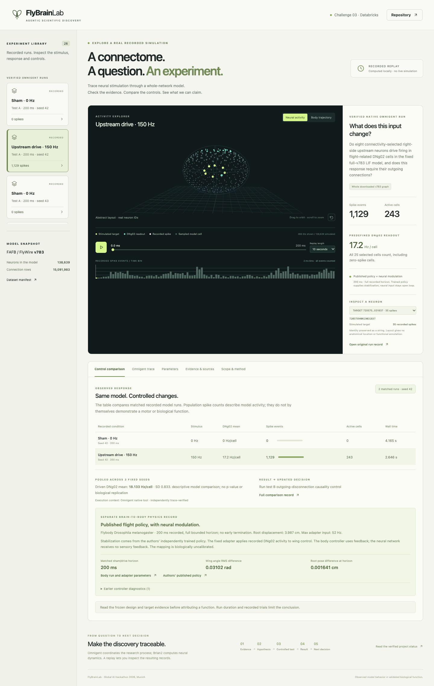

# FlyBrainLab

> **Branch `embodied-fly-lab`: merged team version.** This branch adds Maximilian Kahl's *Embodied Fly Lab* on top of FlyBrainLab `main`
> (nothing from `main` was removed or changed except appended lines in `.gitignore` and `.env.example`):
> numpy re-implementation of the Shiu et al. 2024 whole-brain model (`flylab/brain.py`), frozen descending-neuron bridge (`flylab/bridge.py`),
> NeuroMechFly walking + FlyBody flight bodies (`flylab/body.py`, `flylab/flight.py`), connectome-guided discovery screen (`flylab/screen.py`),
> movement verifier (`flylab/verify.py`), Omnigent lab with 9 agents and policies (`agents/fly_lab.yaml`), recorded runs (`runs/`),
> Streamlit dashboard (`app.py`), static 3D replay viewer with story mode (`web/`), expert-board discussion page with a simple view for non-experts and live updates (`web/board.html`, `flylab/board.py`), independent session audit (`flylab/audit.py`), macOS launcher (`agents/omni.sh -ApproveAtLaunch lab "<question>"`), knowledge base export in the FlyBrainLab schema (`data/knowledge/`).
> Full description, results and limitations: **[EMBODIED_FLY_LAB.md](EMBODIED_FLY_LAB.md)**. GitHub Pages publishes `web/` (locally: `python3 -m http.server 8777 --directory web`).


**Ein quellenbasierter Forschungsworkflow verbindet ein vollständiges Fliegengehirnmodell mit kontrollierten Experimenten und einer virtuellen Fliegenkörper-Physik.** Challenge 03: Databricks „Agentic Scientific Discovery“, Global AI Hackathon Munich, 3.–4. Oktober 2026.

**[Öffentliche interaktive Demo](https://valleebo.github.io/FlyBrainLab/)** · [Ergebnisse und Grenzen](docs/RESULTS.md) · [Teamstand](TEAM_STATUS.md) · [GitHub-Issues](https://github.com/JonasMayerDev/FlyBrainLab/issues) · [Abgabeunterlagen](submission/README.md) · [Vier Videoentwürfe und Downloadpaket](https://github.com/JonasMayerDev/FlyBrainLab/releases/tag/demo-2026-10-04)

Die Demo spielt echte vorberechnete Runs ab. Sie rechnet keine Simulation im Browser. Der vollständige FAFB-FlyWire-v783-Graph umfasst 138.639 Neuronen und 15.091.983 verarbeitete Verbindungszeilen. Das eingefrorene DNg02-Experiment untersucht neuronale Signalübertragung; die Körperkopplung nutzt einen ausdrücklich angenommenen Motoradapter. **Die vorhandene Autoren-Policy stabilisiert den Körper im geprüften 200-ms-Fenster. Biologisch validierter Flug allein durch das Connectome ist nicht nachgewiesen.**

## Was funktioniert

| Baustein | Nachweis |
|---|---|
| Vollgraph-Neuronenrechnung | Gepinnter Shiu-Autorencode + Brian2; echte Sham-/Stimulations-/Disconnection-Runs, Seeds 42/43/44 |
| Wissenschaftliche Targets | 25 DNg02-IDs in v783 verifiziert; Primärliteratur, vier gehashte Quellensnapshots und geprüfte KB-Claims |
| Vorab eingefrorene Untersuchung | Zwei Testdesigns, versiegelte Parameter/Targets und ergebnisabhängige nächste Entscheidung |
| Verifizierter Discovery-Loop | Omnigent 0.16.0: zwei echte Sessions mit insgesamt zehn abgeschlossenen Handoffs; neue Tests A und B samt Kontrollauswertung und ergebnisabhängiger Folgeentscheidung, streng verifiziert |
| Körperphysik und Kopplung | Flybody/MuJoCo + vorhandene Autoren-RL-Policy; sechs gekoppelte 200-ms-Läufe ohne vorzeitiges Ende. Eingefrorener Open-loop-Adapter, keine biologische Kalibrierung |
| Öffentlicher Viewer | Vite + TypeScript + Three.js, GitHub Actions/Pages; 26 echte neuronale Runs, zwölf davon nativ verifiziert; sechs passende Körperreplays, Zeitsteuerung, Messwerte, Quellen und A→B-Provenienz |
| Engpassmessung | Wiederholter identischer 25-ID-Abruf: 427,73 ms erneutes Par­sen versus 0,282 ms geprüfter KB-Claim; eng begrenzte Cache-Messung |

Manuelle Machbarkeitsläufe und tatsächlich unter Omnigent ausgeführte Experimente müssen getrennt beurteilt werden. [Trace A](data/discovery/native-trace.json), [Trace B](data/discovery/native-trace-b.json) und echte Tool-Receipts belegen beide vollständigen Loops. Die zweite Session liest den verifizierten A-Entscheidungsrecord vor Planung und Ausführung von B; dieser Übergang ist separat geprüft. Ein Provenienzlabel allein genügt nicht. [Resultate](docs/RESULTS.md), [Neuronale Rohdaten](data/runs/), [Experimentdesign](research/designs/), [Körperintegration](docs/BODY_INTEGRATION.md).



## Lokal starten

Die geprüfte Plattform ist macOS/arm64, Python 3.12, 8 GiB RAM. Numerische Läufe werden seriell gerechnet. Ein Teamrechner benötigt eigene Zugänge und eigene KB; diese werden nicht mit Git übertragen.

```sh
git clone https://github.com/JonasMayerDev/FlyBrainLab.git
cd FlyBrainLab
UV_CACHE_DIR="$PWD/.cache/uv" uv venv --python 3.12 .venv
UV_CACHE_DIR="$PWD/.cache/uv" uv pip install --python .venv/bin/python -r requirements.lock
.venv/bin/python scripts/check_setup.py
.venv/bin/python scripts/omnigent_run.py --check
.venv/bin/python -m unittest discover -s tests -v
```

### Viewer

Statische Seite ohne Build-Schritt in `web/` (3D-Replay, Expert Board, Film). Lokal:

```sh
python3 -m http.server 8777 --directory web
```

Ein Push nach `main`, der `web/` ändert, veröffentlicht sie über GitHub Actions auf https://valleebo.github.io/FlyBrainLab/ (zusätzlich unter `/lab/`).

Replay-Exporte sind klein und versioniert unter `data/replay/`. Neue tatsächliche Runs exportieren: `.venv/bin/python scripts/export_replays.py`. IDs als Strings erhalten. Körperzustände werden nur für den tatsächlichen simulierten Zeitraum wiedergegeben.

### Gehirn und wissenschaftlicher Vergleich

```sh
.venv/bin/python -m simulation.download_brain
.venv/bin/python -m simulation.brain validate
.venv/bin/python -m simulation.experiment --test A
.venv/bin/python -m simulation.experiment --test B
```

Die Originaldateien werden über versionierte Originalquellen geladen und anhand der Manifest-Hashes geprüft; sie liegen nicht in normalem Git. Die Direktbefehle sind manuelle Runs. Für die tatsächliche Agentenschleife Omnigent verwenden. Details: [Simulation](simulation/README.md), [versiegeltes Design](research/designs/EXPERIMENT_DESIGN.md).

### Omnigent und Knowledgebase

KB und veränderlicher Dienstzustand bleiben außerhalb iCloud unter `~/Library/Application Support/FlyDiscovery/`. Reproduzierbare Quellenimporte: [Evidenz](research/evidence/DNG02_EVIDENCE.md). Keine Schlüssel in Chat, Dateien oder Git schreiben.

Mit bereits angemeldeter Codex-CLI und importierten echten Primärquellen:

```sh
.venv/bin/python -m research.download_evidence --output-dir /tmp/flybrain-evidence
.venv/bin/python -m research.import_dng02_evidence \
  --annotations-tsv /tmp/flybrain-evidence/flywire-neuron-annotations-v2.1.0.tsv \
  --namiki-html /tmp/flybrain-evidence/namiki-dng02-paper.html \
  --shiu-html /tmp/flybrain-evidence/shiu-brain-model-paper.html
.venv/bin/python scripts/omnigent_run.py --check --harness codex --evidence-mode existing --model gpt-5.5
.venv/bin/python scripts/omnigent_run.py --harness codex --evidence-mode existing --model gpt-5.5 --discovery
```

Das Modell muss vom tatsächlichen Konto unterstützt werden; die geprüfte CLI meldete GPT-5.5. Der Launcher erzeugt ein isoliertes natives Bundle und CLI-Wrapper, ohne Benutzerkonfiguration oder Anmeldung umzuschreiben. Providerkosten-/Toolgrenzen gelten; native Shell und fremde MCP-Server werden unterdrückt. `existing` entfernt BrightData-Tools und verwendet echte bereits gespeicherte Evidenz.

Am 4. Oktober sind ein echter Claude-Haiku-Aufruf sowie BrightData-MCP-Suche und Seitenabruf erfolgreich geprüft: [Zugangsbelege](research/provider-access-2026-10-04.json). Das bestätigt die Zugänge; die bisherigen nativen A/B-Loops liefen weiterhin über Codex. Promo-Guthaben und eine zusätzliche Claude-/BrightData-Discovery-Schleife sind damit nicht nachgewiesen.

Für BrightData-MCP werden keine eigenen SERP-/Web-Unlocker-Zonennamen benötigt. Der Helfer fragt das im Dashboard geprüfte verbleibende Freikontingent ab und begrenzt auf höchstens zwei gezählte Versuche:

```sh
.venv/bin/python scripts/with_credentials.py --brightdata-mcp -- .venv/bin/python scripts/brightdata_client.py status
```

Die alternative REST-Route benötigt aktivierte SERP-/Web-Unlocker-Zonen und einen bestätigten Requesttarif:

```sh
.venv/bin/python scripts/with_credentials.py --anthropic --brightdata --unlocker -- .venv/bin/python scripts/omnigent_run.py --discovery
```

Schlüssel werden verdeckt abgefragt und nur an den Kindprozess weitergegeben. Der lokale MCP-Zähler begrenzt Aufrufversuche, erzwingt aber kein Anbieter-Ausgabenlimit. Start- und Policy-Details: [agents/README.md](agents/README.md), [research/README.md](research/README.md).

### Körperphysik

Eigene isolierte `.runtime/body-venv`; keine Änderung der Hauptumgebung. Versionspins, Installations-/Runbefehle und Controllerherkunft: [BODY_INTEGRATION.md](docs/BODY_INTEGRATION.md). Die Baseline benutzt vorhandene Autorenbausteine und kein neues RL-Training.

## Veröffentlichung und Abgabe

Das Team-Repository und die Issues bleiben **JonasMayerDev/FlyBrainLab**. Dem angemeldeten Teamzugang fehlen dort Pages-Adminrechte. Deshalb veröffentlicht ein gleichnamiger öffentlicher Hosting-Mirror **valleebo/FlyBrainLab** denselben Viewer über GitHub Actions. Die Demo-Adresse ist `https://valleebo.github.io/FlyBrainLab/`; localhost ist kein Einreichungslink.

Abgabe am **4. Oktober 2026, 15:00 Europe/Berlin**, internes Ziel 14:30. Benötigt werden Teamfoto, drei Plattformvideos jeweils höchstens 60 Sekunden/1 GB sowie eine zusätzliche zweiminütige Track-Demo. HackOS und das verlinkte Google Form müssen beide tatsächlich eingereicht werden; ein Entwurf ist keine Einreichung. [Abgabeunterlagen](submission/README.md) · [Vier Videoentwürfe und Downloadpaket](https://github.com/JonasMayerDev/FlyBrainLab/releases/tag/demo-2026-10-04) enthalten Aufnahmeplan und Validator. Foto, persönliche Teamvorstellung und finale Einreichungen benötigen die Menschen im Team.

## Herkunft und Grenzen

- [Shiu et al. 2024](https://pmc.ncbi.nlm.nih.gov/articles/PMC11446845/): Whole-brain-LIF-Modell, insbesondere Feeding/Grooming-Validierung; Autorencode und MIT-Lizenz unter `simulation/vendor/shiu/`.
- [Namiki et al. 2022](https://pmc.ncbi.nlm.nih.gov/articles/PMC9206711/): DNg02-Flügelamplitude in schon fliegenden Fliegen.
- [FlyWire-Annotation](https://github.com/flyconnectome/flywire_annotations): gepinnte v783-Identitäten; keine BANC-/v630-IDs mischen.
- [Flybody](https://github.com/TuragaLab/flybody): Körperphysik und vorhandener approximierter Controller, Apache-2.0-Lizenz dokumentiert.
- [Omnigent](https://github.com/omnigent-ai/omnigent): tatsächliche Agenten- und Sessionorchestrierung; LLMs ersetzen keine neuronale oder physikalische Integration.

Eine reagierende Population, ein angenommener Motoradapter, physikalische Bewegung und eine 3D-Darstellung sind vier getrennte Nachweise. Die aktuellen Ergebnisse tragen einen transparenten kontrollierten Modellbefund, keine vollständige Gehirnemulation oder neue biologische Flugvalidierung.
