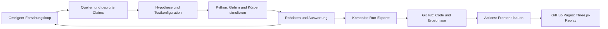

# Stack und öffentliche Demo

Stand:4.Oktober2026, nach echten DNg02-A/B-Machbarkeitsläufen, Körperkopplung und öffentlicher Viewer-Veröffentlichung. Kanonisches Repository: `JonasMayerDev/FlyBrainLab`; öffentliche Pages-Demo: https://valleebo.github.io/FlyBrainLab/. Der Hosting-Mirror veröffentlicht denselben statischen Build, weil Pages-Adminrechte im Teamrepo fehlen. Native Omnigent-Loop-Verifikation wird separat geführt; Anbietercredits/BrightData sind weiter unbestätigt. Siehe `TEAM_STATUS.md`, `docs/RESULTS.md`.

## 1. Bestätigte Anforderungen

- Challenge 03: Databricks „Agentic Scientific Discovery“, mit tatsächlicher Omnigent-Forschungsschleife.
- Öffentlicher Zugang zur Jury-Demo; eine localhost-Adresse genügt nach aktuellem Nutzerbericht nicht.
- Eigener Code und nachvollziehbare Projektergebnisse auf GitHub.
- **Vom Nutzer gewählter Demo-Modus: echte vorberechnete Läufe interaktiv ansehen.** Neue Simulationen müssen in der öffentlichen Oberfläche nicht berechnet werden.
- Flug bleibt die Nutzer-Vision. Die Wahl eines Replay-Viewers ist keine Entscheidung, dieses Verhalten durch Walking zu ersetzen.

## 2. Stackentscheidung

| Teil | Wahl | Aufgabe / Status |
|---|---|---|
| Forschungsorchestration | Omnigent | Spezialagenten, Quellenprüfung, Testauswahl, Toolausführung, Ergebnis und nächste Entscheidung; zwingend tatsächlich ausführen |
| Knowledgebase | JSONL + Quellenmanifest | Kleine nachvollziehbare Claims mit Herkunft, IDs, Version und Prüfstatus; keine zusätzliche Datenbank nötig |
| Neuronale Simulation | Python + Brian2; vorhandenes Shiu-Modell | v783/Shiu gepinnt; 25 DNg02-Readouts und A/B-Vergleiche tatsächlich gerechnet |
| Körperphysik | MuJoCo; Flybody als bevorzugter Pilot für das Flugziel | Flybody/MuJoCo installiert; eingefrorener Open-loop-Adapter und echte kurze Körperruns vorhanden |
| Export | JSON für Metadaten, Aktivität/Messwerte und Körpertrajektorie | Kleine reproduzierbare Viewerdaten aus echten Runs; volle Rohdaten getrennt erhalten |
| Öffentliche Oberfläche | **Vite + TypeScript + Three.js** | Experimente wählen, abspielen, pausieren und zeitlich untersuchen; Aktivität, Bewegung, Kontrollen und Quellen zeigen |
| Code und Veröffentlichung | **GitHub-Repository + GitHub Actions + GitHub Pages** | Frontend bauen und öffentliche HTTPS-Seite veröffentlichen |

Der öffentliche Viewer ist entschieden. Brain-Baustein inzwischen eingerichtet: FAFB/FlyWire v783 + Shiu-Autorencode/Brian2, echte 20-ms-Whole-network-Runs erfolgreich. MuJoCo/Flybody ist inzwischen mit echten Zuständen und kausalem Motoradapter nachgewiesen; stabile/biologisch kalibrierte Flugsteuerung bleibt offen. FlyGym/NeuroMechFly bleibt ein möglicher Walking-Einstieg, falls das Team später diesen engeren MVP ausdrücklich wählt; heute nicht zwei Körperframeworks gleichzeitig integrieren.

Three.js zeichnet die 3D-Szene. Die Bewegung kommt aus den exportierten Körperzuständen der Simulation. Ein Connectome, die neuronale Dynamik und die Motorsteuerung sind separate Bausteine. Ein vorhandener Flugcontroller beweist allein keine connectomebasierte Flugsteuerung.

## 3. Datenfluss und Rechenort



Omnigent und die numerischen Runs laufen lokal. Installation, nativer Agenten-/Toolcheck und Dienst-Healthcheck sind erfolgreich. Die Codex-Route nutzt vorhandene CLI-Anmeldung; BrightData/Anthropic-Schlüssel fehlen weiterhin. Die kurzen Brain-Runs sind auf der 8-GiB-Maschine gemessen, keine Garantie für längere Runs/Körperkopplung. KB und Omnigent-Zustand liegen unter `~/Library/Application Support/FlyDiscovery/`, außerhalb des iCloud-Projekts. Eine öffentlich betriebene Simulations-API ist für den gewählten Replay-Modus nicht erforderlich.

GitHub Pages liefert statisches HTML/CSS/JavaScript und Run-Dateien aus. Dort läuft kein Python-/Omnigent-Server. Actions übernimmt zuerst nur Build und Veröffentlichung; Simulationsjobs dort erst nach gemessenem Ressourcen-Pilot ergänzen. Ein CI-Workflow ersetzt den vorgeschriebenen Omnigent-Loop nicht.

## 4. Was die Jury sieht

1. Frage und Hypothese mit konkreten Quellen.
2. Auswahl eines tatsächlich berechneten Stimulations- oder Kontrolllaufs.
3. 3D-Körperansicht, sofern eine reale Körpertrajektorie vorliegt; synchronisierte neuronale Messwerte und Zeitleiste.
4. Parameter, Modellversion, Seed, Motoradapter und Vergleichsergebnis.
5. Omnigent-Übergaben und aus dem Ergebnis abgeleitete nächste Forschungsentscheidung.

Die Oberfläche nennt den Modus **„Aufgezeichneter Simulationslauf“**. Ein Auswahlknopf lädt einen Run; er behauptet keinen neuen Live-Stimulationsversuch. Bei einem nur neuronalen Run zeigt die Seite neuronale Daten und kennzeichnet die fehlende Körperkopplung. Keine erfundene Körperbewegung ergänzen.

Ganzhirnaktivität kann als Raster, Zeitreihe oder aggregierte Ansicht gezeigt werden. Eine ausgewählte Neuronengruppe oder Aggregation als solche kennzeichnen; nicht alle Synapsen als 3D-Geometrie laden müssen. Die vollständigen Simulationsoutputs bleiben reproduzierbar verlinkt.

## 5. Repository und Exportvertrag

Zielstruktur; Agenten, Simulation, Research-/KB-Tools, Daten/Run Records und lokales Git sind inzwischen angelegt. `frontend/` und der Pages-Workflow sind aufgebaut:

```text
agents/                  Omnigent-Rollen, Tools und Policies
research/                öffentliche Quellenmetadaten/Schema; KB bleibt lokal
simulation/              Python, Stimulationsprotokolle, Motoradapter
experiments/             zwei Testdesigns und eingefrorene Konfigurationen
results/                 Run Records, Messwerte, Analyse, größere Dateien verlinkt
frontend/                Vite + TypeScript + Three.js
data/replay/             kleine veröffentlichte Replay-Dateien
scripts/                 Daten-Download, Export und Reproduktion
.github/workflows/       Frontend-Build und Pages-Veröffentlichung
README.md                Startanleitung, Demo, Evidenz, Grenzen und nächste Frage
```

Jeder Run-Export enthält mindestens:

- `run_id`, Test/Hypothese, tatsächlicher Ergebnisstatus und Berechnungszeitpunkt.
- Daten-/Modell-/Codeversion, Parameter, Seed, Stimulations- und Kontrollbedingungen.
- Einheit und Zeitbasis jeder Messgröße; synchronisierte neuronale und gegebenenfalls Körperdaten.
- Herkunft der Körperbewegung: Modell, Controller, Motoradapter und Open-loop/Closed-loop-Status.
- Links zu Quellen, Rohdaten, Auswertung und Omnigent-Run-Record.

Keine API-Schlüssel, Zugangscodes oder personenbezogenen Geheimnisse veröffentlichen. Alle eigenen Quelltexte, Spezifikationen, Konfigurationen und kleinen Ergebnisse ins Repo. Große fremde Connectome-Dateien über Originalquelle und Downloadskript mit Lizenz, Version und Prüfsumme reproduzierbar machen. Große eigene Rohdaten gegebenenfalls als GitHub-Release-Dateien verlinken. Volltexte nur entsprechend ihrer Lizenz weitergeben.

Normales GitHub-Git blockiert Dateien über 100 MiB; veröffentlichte Pages-Seiten dürfen höchstens 1 GB groß sein. Diese Grenzen sind Obergrenzen, keine Zielgrößen. Viewer mit kleinen, zeitlich reduzierten Exporten bauen; Rohdaten und Reduktionsmethode erhalten.

## 6. Erste Meilensteine und Stop-Kriterien

1. **Erreicht:** öffentlicher Pages-Viewer anonym auf Desktop und Mobile geprüft. 26 echte neuronale Runs, davon zwölf streng verifizierte native A/B-Bedingungen; sechs zugeordnete 200-ms-Körpertrajektorien mit vorhandener Autorenpolicy. Zwei native Sessions, zehn Handoffs und tatsächliche A→B-Verknüpfung sind im Viewer belegt.
2. **Bis 02:00:** kleiner echter neuronaler Baseline-Run oder klar dokumentierter Blocker; Laufzeit und Speicherbedarf messen. Parallel vorhandenen Flybody-Controller separat prüfen. Verfügbare Zeit nicht durch eine zweite Hostingarchitektur verbrauchen.
3. **Bis 09:30:** Kopplung und erste echte Exporte prüfen. Bei fehlender Körperkopplung vorhandenen neuronalen Forschungsloop sichern und Embodiment als offene Arbeit kennzeichnen.
4. **Bis 11:30:** gewählten Vergleich ausführen, interpretieren und nächste Entscheidung unter Omnigent erzeugen; Viewer mit echten Ergebnissen veröffentlichen, Feature-Freeze.
5. **Bis 12:15:** endgültige öffentliche URL samt Assets, Quellen und Repo-Zugriff auf fremdem Gerät kontrollieren; dann Videos aufnehmen.

Video ist Pflichtliefergegenstand und Ausfallreserve. **Video allein ist aktuell keine bestätigte alternative Abgabe.** Öffentlicher Viewer, GitHub und beide Einreichungen bleiben eingeplant. Auch ein Replay-Viewer ersetzt nicht den tatsächlichen wissenschaftlichen Run und die geforderte Omnigent-Schleife.

## 7. Verifizierte technische Quellen

- [Three.js-Grundlagen](https://threejs.org/manual/pages/fundamentals.html): Szenen, Kamera und Rendering.
- [GitHub Pages](https://docs.github.com/en/pages/getting-started-with-github-pages/what-is-github-pages): statisches Hosting aus dem Repository.
- [Vite-Deployment auf GitHub Pages](https://vite.dev/guide/static-deploy.html#github-pages): Build nach `dist`, Projektpfad über `base`, Veröffentlichung über Actions.
- [GitHub-Dateigrenzen](https://docs.github.com/en/repositories/working-with-files/managing-large-files/about-large-files-on-github) und [Pages-Limits](https://docs.github.com/en/pages/getting-started-with-github-pages/github-pages-limits).
- [Shiu-Modell](https://github.com/philshiu/Drosophila_brain_model) und [Flybody](https://github.com/TuragaLab/flybody): bestehende numerische Bausteine; keine automatisch vorhandene gemeinsame Brain-to-Flight-Kopplung.

Weitere wissenschaftliche Grenzen und Abgabeanforderungen: `AGENTS.md` und `HACKATHON_PLAN.md`.

## 8. Hackathon-Credits sinnvoll einsetzen

Die vom Nutzer gezeigten Werte bezeichnen verschiedene Anbieterangebote; sie sind kein gemeinsames frei verfügbares Rechenbudget. „Code claimed“ bestätigt keinen aktuellen Saldo oder ein bereits aktives Abonnement. Konkrete Promo-Berechtigungen und Aktivierung sind noch nicht geprüft; keine Einlösung ausgeführt.

| Angebot | Empfohlener Einsatz | Nächste Prüfung |
|---|---|---|
| Anthropic, 25 USD | Claude als Modellzugang für Omnigent: Evidenz extrahieren, Hypothesen bilden, Ergebnisse interpretieren, Coding unterstützen | Angebot im berechtigten Console-Konto einlösen, tatsächlichen Saldo prüfen, Schlüssel sicher in der Agentenumgebung konfigurieren, kleinen Aufruf/Verbrauch testen |
| BrightData, 300 USD | Suchergebnisse und zugängliche Forschungsseiten für den Rechercheagenten; genaue Quellen/Fundstellen erhalten | Promo aktivieren; enthaltene Produkte, API-Zugriff und Beispielanfrage prüfen. Direkt verfügbare Daten/Papers nicht unnötig durch Scraping ersetzen |
| Lovable Pro, ein Monat | Optional Layout, Kontrollen, Quellen- und Ergebnisansicht entwickeln; Three.js bleibt der Viewer realer Exporte | Pro-/Credit-Status prüfen; GitHub-Sync und tatsächliche statische Buildfähigkeit vor weiterer UI-Arbeit prüfen |
| ElevenLabs Creator, ein Monat | Optional Sprechertext für kurze Plattformvideos und zweiminütige Track-Demo | Einlöseanleitung laut Angebot nutzen; verfügbare Voice-/TTS-Nutzung prüfen. Kein Voice-Feature als zusätzliche MVP-Abhängigkeit |

**Priorität:** erst den Omnigent-Modellzugang nutzbar machen, dann bei Bedarf BrightData. Lovable nutzen, wenn es den bereits gewählten öffentlichen Viewer schneller fertigstellt; ElevenLabs erst für fertige Demoaufnahmen. Mit einem kleinen realen Agentendurchlauf starten und Verbrauch messen, bevor parallelisiert wird. Die 25 USD nicht als garantierte Zahl von Forschungsruns darstellen.

**Lovable-Kompatibilität:** GitHub-Sync und npm-Pakete werden offiziell unterstützt; die Three.js-Nutzbarkeit ist daraus eine technische Schlussfolgerung, noch kein getesteter Viewer. Neue Lovable-Projekte ab 13.5.2026 verwenden TanStack Start mit Serveroutput; ein unveränderter Export läuft deshalb nicht automatisch auf GitHub Pages. Bestehende GitHub-Repositories können laut aktueller GitHub-Integrationsdokumentation nicht importiert werden. Für die beschlossene Pages-Route Layout/Client-Komponenten in das statische Vite-Frontend übernehmen bzw. die vollständige statische Nutzbarkeit prüfen. Eine zusätzliche Serverarchitektur für den Replay-Modus vermeiden. Alternativ Lovables eigenes öffentliches Hosting plus GitHub-Sync verwenden, falls das Team diese Hostingänderung wählt.

Lovable beschreibt inzwischen eine allgemeine Credit-Balance für Bau und Laufzeit; bestimmte Grants bleiben zweckgebunden. Der Pro-Promo-Nennwert ist weder direktes Anthropic-API-Guthaben noch zugesicherte Python-Simulationskapazität. In der fertigen Replay-Oberfläche sind zusätzliche LLM-Aufrufe nicht nötig. Brian2/MuJoCo brauchen weiterhin eine gesondert geprüfte Rechenumgebung.

Offizielle Quellen, am 4.10.2026 geprüft:

- [Omnigent: Modellzugänge](https://github.com/omnigent-ai/omnigent/blob/main/README.md) und [Claude-API-Abrechnung](https://support.claude.com/en/articles/8977456-how-do-i-pay-for-my-claude-api-usage).
- [BrightData SERP API](https://docs.brightdata.com/products/serp-api/introduction).
- [Lovable GitHub-Sync](https://docs.lovable.dev/integrations/github), [npm-Pakete](https://docs.lovable.dev/tips-tricks/npm-packages), [externe Bereitstellung](https://docs.lovable.dev/tips-tricks/external-deployment-hosting) und [Credits/Nutzung](https://docs.lovable.dev/introduction/credits-and-usage).
- [ElevenLabs Text to Speech](https://elevenlabs.io/docs/overview/capabilities/text-to-speech).
